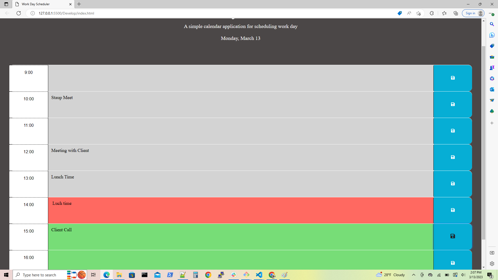

## Work Day Scheduler

## Description
1. Work Day Scheduler is used to schedule business hours for an employee.

2. When employee open the work day scheduler then the current day was displayed at the top of the calendar.

3. There were several blocks of time which represent the business hours, This scheduler is depends on 24 hours of time clock.

4. When the employee scroll down then he can saw these time block are represented with different colors according to the past, present and future. Here, "past" was displayed in "grey" color, the "present" was displayed in "red" color and the future was displayed in "green" color.

5. If the employee want to schedule a task for particular time period, Then he can add the task in front of time block and can save the event by clicking on save button at the end.

6. When the page is reload the employee can see there tasks which they scheduled already.

## Steps I followed:-

1. Clone starter code from the remote repository "crispy-octo-meme" to local repository "workday-scheduler".

2. Manipulated the code according to the Acceptance Criteria.

3. Created "New Repository" in "GitHub" and named it as, "workday-scheduler".

4. Uploaded all the files from local repository to "GitHub". The "README , HTML, CSS" files were already in remote repository.(no need to create)

5. Navigate to "GitHub" repository "workday-scheduler" using "Git Bash".

6. Added description, screenshots in  "README"  file.

7. Performed, "add", "commit", "pull", "push", operations on source code.

8.  Deployed and assigned the "URL" to the website.

9. Added screenshot for final website appearance and Git Bash commands.

## URLs:-
Here, you can find the webpage.

workday-scheduler application's URL:- 

https://anujalawankar.github.io/workday-scheduler/

Here, you can find the GitHub URL:-
GitHub URL:- 

https://github.com/AnujaLawankar/workday-scheduler

## Installation

N/A

## Usage

N/A

## Credits

N/A

## License

N/A

## Assets

The following image demonstrates the web application appearance:
1.  Work Day Scheduler web appearance. Which displayed day and date at the top.

2. Many color blocks which represent time. The grey block represent past time, the red represent the present time and the green represent the future time for the day.

3. In the future block employee can schedule or add any task which they want to complete. There is also save button to saved the changes at the end

4. Save button, saved the task even after the page is reload.

5. All the tasks to be performed were saved in the local storage even after the page is reloaded.

